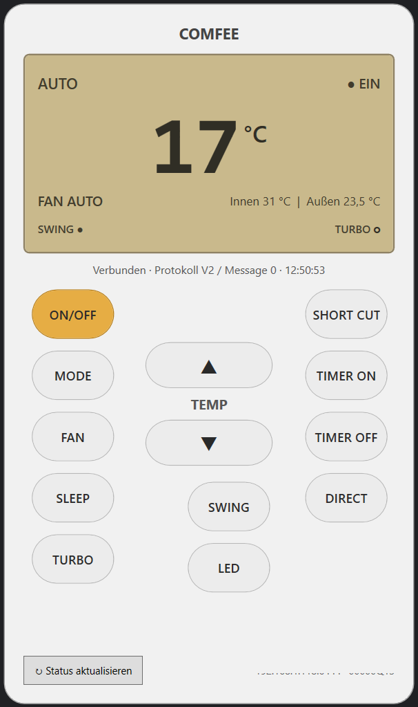

# Comfee Remote

Eine kleine Windows-Fernbedienung für kompatible **Comfee / Midea Split-Klimaanlagen** mit lokaler LAN-Steuerung.

Die Anwendung ist in **C# / WPF** geschrieben und kommuniziert direkt mit der Klimaanlage im lokalen Netzwerk.

Es wird **keine Cloud-Verbindung** für die Steuerung benötigt.



## Funktionen

Aktuell unterstützt:

- Ein / Aus
- Solltemperatur erhöhen / verringern
- Betriebsmodus wechseln
- Lüftergeschwindigkeit
- Sleep
- Turbo
- Swing
- LED / Display am Klimagerät
- Innen- und Außentemperatur anzeigen
- aktueller Betriebsstatus
- Swing- und Turbo-Status im Display
- Short Cut
- automatische Statusaktualisierung
- Minimieren in den Windows-System-Tray

Die Oberfläche orientiert sich dabei an einer normalen Comfee-Fernbedienung.

## Noch nicht vollständig umgesetzt

Folgende Funktionen sind aktuell nur als Bedienelement vorhanden:

- DIRECT
- TIMER ON
- TIMER OFF

Je nach Klimagerät können außerdem einzelne Funktionen vom Gerät selbst nicht unterstützt werden.

---

# Voraussetzungen

## Zum Benutzen der fertigen EXE

Wenn eine veröffentlichte `win-x64`-Version verwendet wird, muss auf dem Ziel-PC normalerweise **nichts zusätzlich installiert werden**.

Die Anwendung wird als self-contained .NET-Anwendung veröffentlicht.

Es wird insbesondere nicht benötigt:

- Python
- pip
- midea-local
- NetHome Plus für die laufende Steuerung

Der PC und die Klimaanlage müssen sich lediglich im selben lokalen Netzwerk befinden.

## Zum Kompilieren

Zum selbstständigen Kompilieren wird benötigt:

- Windows
- .NET 8 SDK
- Visual Studio mit WPF-Unterstützung

---

# Konfiguration

Die Verbindung zur Klimaanlage wird über die Datei

```text
config.json
```

eingestellt.

Beispiel:

```json
{
  "Name": "Wohnzimmer",
  "IpAddress": "192.168.1.100",
  "Port": 6444,
  "DeviceId": 12345678901234,
  "DeviceType": 172,
  "DeviceProtocol": 2,
  "Model": "00000Q13",
  "MessageProtocol": 0,
  "RefreshSeconds": 8
}
```

## Bedeutung der Werte

### Name

Frei wählbarer Name der Klimaanlage.

Beispiel:

```json
"Name": "Wohnzimmer"
```

### IpAddress

Lokale IP-Adresse der Klimaanlage.

Beispiel:

```json
"IpAddress": "192.168.1.100"
```

Die IP-Adresse kann normalerweise in der Geräteliste des Routers gefunden werden.

Je nach Router kann das Gerät beispielsweise als Midea-, Comfee- oder unbekanntes WLAN-Gerät angezeigt werden.

### Port

Der lokale Kommunikationsport.

Bei den bisher getesteten Midea/Comfee-Geräten:

```json
"Port": 6444
```

### DeviceId

Eindeutige Geräte-ID der Klimaanlage.

Beispiel:

```json
"DeviceId": 12345678901234
```

Diese Nummer ist **nicht einfach die Seriennummer** und muss vom Gerät ermittelt werden.

### DeviceType

Gerätetyp.

Für unterstützte Klimaanlagen normalerweise:

```json
"DeviceType": 172
```

172 entspricht:

```text
0xAC
```

### DeviceProtocol

Version des lokalen Geräteprotokolls.

Beispiel:

```json
"DeviceProtocol": 2
```

Diese Anwendung wurde bisher hauptsächlich mit **Midea V2** getestet.

### Model

Vom WLAN-Modul gemeldete Modellkennung.

Beispiel:

```json
"Model": "00000Q13"
```

### MessageProtocol

Kann normalerweise auf:

```json
"MessageProtocol": 0
```

stehen bleiben.

Die Anwendung versucht die benötigte Message-Protocol-Version beim Start automatisch über das Gerät zu ermitteln.

### RefreshSeconds

Abstand der automatischen Statusabfrage in Sekunden.

Beispiel:

```json
"RefreshSeconds": 8
```

---

# Gerätedaten ermitteln

Für die erste Einrichtung müssen insbesondere folgende Werte bekannt sein:

```text
IpAddress
DeviceId
DeviceType
DeviceProtocol
Model
```

Die IP-Adresse findet man normalerweise direkt im Router.

Die übrigen Werte können beispielsweise einmalig mit dem Open-Source-Projekt `midea-local` ermittelt werden.

Python wird dafür **nur zur Ermittlung der Gerätedaten benötigt**, nicht zum späteren Betrieb von Comfee Remote.

## Beispiel mit midea-local

Python installieren und anschließend:

```bash
pip install midea-local
```

Danach beispielsweise:

```python
from midealocal.discover import discover

devices = discover(ip_address="192.168.1.100")

print(devices)
```

Eine mögliche Ausgabe sieht ungefähr so aus:

```text
device_id: 12345678901234
type: 172
ip_address: 192.168.1.100
port: 6444
model: 00000Q13
protocol: 2
```

Diese Werte anschließend in die `config.json` übernehmen:

```json
{
  "Name": "Wohnzimmer",
  "IpAddress": "192.168.1.100",
  "Port": 6444,
  "DeviceId": 12345678901234,
  "DeviceType": 172,
  "DeviceProtocol": 2,
  "Model": "00000Q13",
  "MessageProtocol": 0,
  "RefreshSeconds": 8
}
```

Danach wird Python nicht mehr benötigt.

---

# Netzwerk prüfen

Die Klimaanlage muss vom Windows-PC erreichbar sein.

Unter PowerShell kann der Port getestet werden:

```powershell
Test-NetConnection 192.168.1.100 -Port 6444
```

Bei erfolgreicher Verbindung sollte unter anderem erscheinen:

```text
TcpTestSucceeded : True
```

Wenn dort `False` steht, sollte geprüft werden:

- Ist die Klimaanlage eingeschaltet?
- Ist das WLAN-Modul verbunden?
- Befinden sich PC und Klimaanlage im selben Netzwerk?
- Stimmt die IP-Adresse?
- Verhindert eine Firewall oder WLAN-Isolation die Verbindung?

---

# Projekt starten

Das Projekt in Visual Studio öffnen:

```text
ComfeeRemote.csproj
```

und anschließend starten.

Alternativ:

```bat
build.cmd
```

---

# Einzelne Windows-EXE erstellen

Zum Erstellen der self-contained Windows-Version:

```bat
publish-win-x64.cmd
```

Die fertige Anwendung befindet sich anschließend unter:

```text
bin\Release\net8.0-windows\win-x64\publish\
```

Dort befindet sich:

```text
ComfeeRemote.exe
```

Die benötigte .NET-Laufzeit wird bei dieser Veröffentlichung mitgeliefert.

---

# System-Tray

Beim Minimieren kann Comfee Remote im Infobereich von Windows neben der Uhr weiterlaufen.

Über das Tray-Symbol kann die Anwendung wieder geöffnet oder beendet werden.

---

# Hinweis zum Status nach Befehlen

Einige ältere Midea-V2-Geräte übernehmen einen Befehl sofort, melden bei einer direkt folgenden Statusabfrage jedoch für kurze Zeit noch den vorherigen Wert zurück.

Comfee Remote berücksichtigt dieses Verhalten und führt Statusabfragen zeitversetzt erneut aus.

---

# Kompatibilität

Getestet wurde die Anwendung mit einer Comfee-Klimaanlage mit Midea-V2-LAN-Protokoll.

Andere Comfee-, Midea- oder baugleiche Klimageräte können funktionieren, sind jedoch nicht garantiert kompatibel.

Insbesondere neuere Geräte mit anderen Protokollversionen können eine zusätzliche Authentifizierung oder andere Protokolle verwenden.

---

# Verwendetes Protokoll

Die lokale Protokollimplementierung orientiert sich unter anderem an den Erkenntnissen des Open-Source-Projekts:

`midea-lan/midea-local`

Comfee Remote benötigt diese Python-Bibliothek zur Laufzeit jedoch nicht.

Die benötigten Teile des lokalen Midea-V2-Protokolls sind direkt in C# umgesetzt.

---

# Haftungsausschluss

Dieses Projekt ist ein inoffizielles Community-Projekt.

Es besteht keine Verbindung zu Midea, Comfee oder deren Herstellern.

Die Benutzung erfolgt auf eigene Verantwortung.

Markennamen und Produktnamen gehören ihren jeweiligen Eigentümern.
